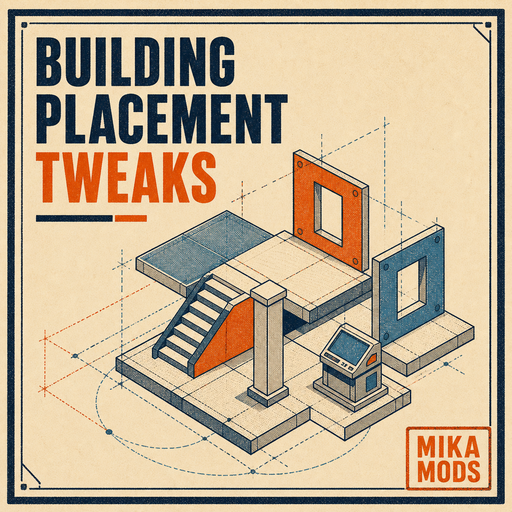

# Building Placement Tweaks

Building Placement Tweaks gives Base builders more room to create. Combine
supported pieces more closely, adapt builds to steep or uneven terrain, reach
new heights, and realize larger, more ambitious layouts.

## Highlights

- Place supported structures, decorations, lights, and workstations closer
  together or overlap them for more detailed builds.
- Shape creative builds on steep slopes and uneven ground.
- Expand upward and downward, including elevated and floating sections.
- Grow larger Bases with greatly expanded construction capacity.
- Place Breeding Farms, Ranches, Palboxes, Item Retrieval Machines, Pal Essence
  Condensers, and Pal Expedition Stations more flexibly.
- Continue building throughout the area around the Palbox.
- Place as many Pal Expedition Stations in each Base as you want.

See [docs/FEATURES.md](docs/FEATURES.md) for the complete list of supported
structures.

## Downloads

- [Steam Workshop](https://steamcommunity.com/sharedfiles/filedetails/?id=3783134964)
- [Windows client PAK](Client/BuildingPlacementTweaks_Windows_P.pak)
- [Windows Dedicated Server PAK](Server/BuildingPlacementTweaks_WindowsServer_P.pak)
- [Linux Dedicated Server PAK](ServerLinux/BuildingPlacementTweaks_LinuxServer_P.pak)
- [Latest Linux Dedicated Server release](https://github.com/mikaba-eu/palworld_building_placement_tweaks/releases/latest/download/BuildingPlacementTweaks_LinuxServer_P.pak)

## Installation

### Steam Workshop

Subscribe on Steam, enable **Building Placement Tweaks** under
**Options -> Mod Management**, and restart Palworld.

### Manual client or server installation

Choose the PAK built for the target platform and place it in that Palworld
installation's active PAK mod directory. Keep the same mod version across the
participating client, host, and server installations.

## Repository

- [Source repository](https://github.com/mikaba-eu/palworld_building_placement_tweaks)
- [Build and release guide](docs/BUILD.md)
- [One-command Workshop publishing](docs/PUBLISHING.md#steam-workshop)
- [Steam Workshop description](STEAM_DESCRIPTION.txt)
- [Publishing checklist](docs/PUBLISHING.md)
- [Technical details](docs/TECHNICAL_DETAILS.md)
- [Version history](CHANGELOG.md)
